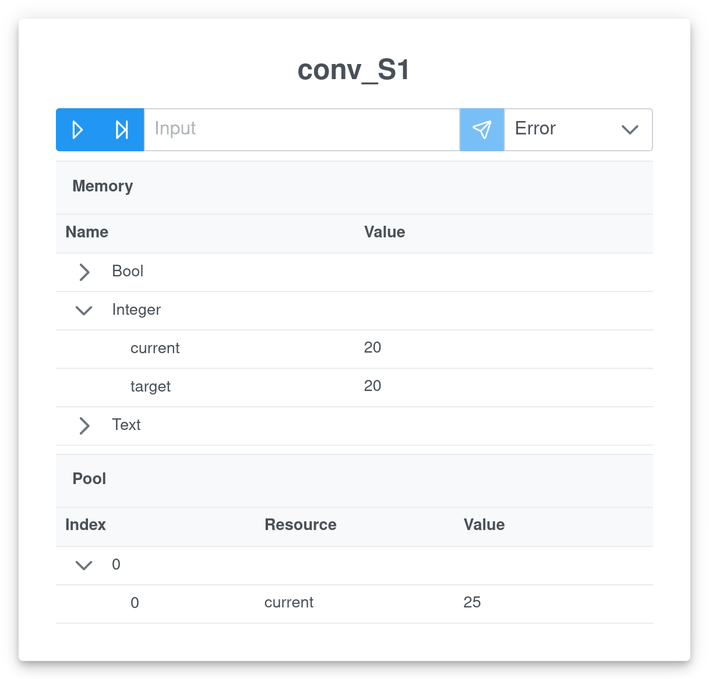

# µSteel simulator
The µSteel simulator project aims to provide an environment to simulate and test µSteel language. The core idea is to easily and automatically create and simulate a complex network of agents running µSteel-lang.

This is achieved through the use of Docker. µSteel simulator provides a simple way to model the underlying network and its actors. It mimics the work of docker-compose, but in a specialized way.

Here I describe the simulator parts and I describe an example.

## steel-simulator
`steel-simulator` is the main command to set up and execute the simulation. It is written in Go and built using `go build`.

It creates the µSteel agents defined in a configuration file, a coordinator to interact (get/set memory, pause, step...) with the agents, the data and control network, and, optionally, a GUI (served as a web application).

It assumes a running instance of the Docker daemon on the host machine. Moreover, the Docker images of the agent, coordinator and GUI needs to be found on the machine. These can be built using the `build.sh` script in the relevant directories.

```
Usage of steel-simulator:
  -c string
        configuration file (default "steel-simulator.yml")
  -g    spawn GUI with simulator
  -gui-image string
        GUI docker image (default "steel-gui")
  -gui-port int
        GUI docker port (default 8080)
```

`steel-simulator` is always run with a subcommand:
- `up`, to create the environment. The default behaviour is to create the environment, show the logs and finally destroying it. To prevent this, use the additional flag is `-d` (*detached*), to run the command and release the console.
- `down`, to destroy the environment.
- `logs`, to get the logs of the running containers (except the GUI). To continue showing the incoming log lines use the `-f` (*follow*) flag.

### Configuration file
The configuration is provided via YAML files.

The syntax is the following:
- `version`, to specify a configuration version (at the moment must be "1.0").
- `image`, to specify the docker image for the agents.
- `coordinator_image`, to specify the docker image for the coordinator.
- `namespace`, to define a prefix for all containers and networks of the simulation.
- `includes`, a list of files to append to the configuration. Included files are only considered in terms of `version`, `agents` and `prototypes`. Every other field is ignored.
- `agents`, a dictionary of agents.
- `prototypes`, a dictionary of prototypes.

A *prototype* is a mean to define a common structure for similar agents. It is formed by several fields:
- `memory_controller`, to define the controller for the memory, i.e. the implementation. At the moment the only valid controller is `basic` (i.e. the usual data types: bool, integer, float, text and time).
- `tick`, to define the refresh rate, i.e. the minimum time between two Exec() (default 1s).
- `memory`, a list of strings representing the variables. The string must be in the format `<type>:<identifier>[:<initialization_value>]`, where `[...]` denotes an optional argument.
- `rules`, a list of rules, according to the language specification.

An *agent* is so defined:
- `prototype`, optional, to define a prototype to specialize the agent from.
- any field from the *prototype* definition, optional. These fields have priority over the prototype ones, e.g. if the prototype defines the variable `k` to have value `pluto` and the agents redefines it as `pippo`, the valid initialization value will be `pippo`.

## steel-simulator-gui
The GUI is a web application. The default URL is http://localhost:8080

The GUI interface is self-explanatory, but a couple things may be added:
- every interaction is done via the *plus* button on the bottom right. This allows for configuration loading and unloading, data refreshing and access to settings.
- Partial configuration are allowed. If a partial configuration (i.e. a include) is uploaded, only agents defined there are showed.
- The *Explore* tab shows the exact configuration of the agent at the moment of creation.

The *Interact* tab shows a card for each agent. Inside of it the agent state (memory and pool) and all of the interaction possibilities are presented.

The upper bar allows for:
- pausing/resuming the Exec() for the agent.
- stepping a single Exec().
- performing an Input() on the agent.
- setting the verbosity level.



## steel-simulator-environment
`steel-simulator-environment` is the a command to execute the an environment for the simulation. It is written in Python3 and can be run with the `python` interpreter.

Its goal is to simulate a physical environment for the simulation. For example, it can automatically change the temperature registered on a sensor agent as the change comes from a physical termocouple.

It is configured directely by editing the `steel-simulator-environment.py` script, between the tags `BEGIN user defined code` and `END user defined code`.

The customization is done via `env.on('<agent>', '<variable>', <tick>, <action_callback>)`. This means that every `<tick>` seconds the value of the `<variable>` of the `<agent>` is retrieved from the coordinator and `<action_callback>` is executed.

`<action_callback>` will be called with two arguments: the value of the `<variable>` and the set of all the values of the variables of the agent.

To decorate the callback with other values it is possible to use higher-order functions:
```python
def decorator(var):
    def callback(value, values):
        # `var` is available here
        pass
    return callback

env.on('ag1', 'var1', 10, decorate('pippo'))
```

Inside the callbacks two functions are useful:
- `env.get_variables('<other_agent>')`, to get the values of the variables of another agent.
- `env.post_input('<other_agent>', '<command>')`, to modify, according to `<command>`, the state of another agent.

The provided example modifies the temperature of a room according to the HVAC status (increasing or decreasing temperature).

## Example
The repository provides an example.

Move to the `steel-simulator` folder.

Build the images for the agents, coordinator and gui:
```shell
../steel-simulator-agent/build.sh
../steel-simulator-coordinator/build.sh
../steel-simulator-gui/build.sh
``` 

Then run
```shell
go build && ./steel-simulator -c ../steel-simulator.yml -g up
```
to start the simulation.

To start the environment run `steel-simulator-environment.py` from the environment folder.

The GUI is at http://localhost:8080

To stop the simulation just send SIGINT (Ctrl-C) to the simulator and environment.